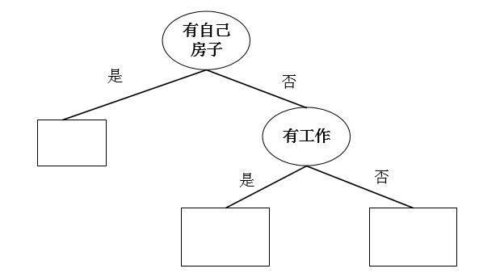

#**$$XGBOOST$$**
------
###**ID3:**
信息增益(information gain)
**$$Gain(D,a)=Ent(D)-\sum_{v=1}^V\dfrac{|D^v|}{|D|}{Ent(D^v)}\quad\quad(1)$$**
其中：$Ent(D)=-\sum_{k=1}^y{P_klog_2P_k}$也称为熵。
$\quad\quad$决策树的本质是训练数据集中归纳出一组分类规则，我们需要的是一个训练数据矛盾较小的决策树，同时具有很好的泛化能力。$Ent(D)$的值越小，则$D$的训读就越高,熵表示随机变量不确定性的度量。
$$表一：贷款申请样本数据表$$
| ID | 年龄 | 有工作 | 有自己房子 | 信贷情况 | 类别 |
|----|------|--------|------------|----------|------|
| 1 | 青年 | 否 | 否 | 一般 | 否 |
| 2 | 青年 | 否 | 否 | 好 | 否 |
| 3 | 青年 | 是 | 否 | 好 | 是 |
| 4 | 青年 | 是 | 是 | 一般 | 是 |
| 5 | 青年 | 否 | 否 | 一般 | 否 |
| 6 | 中年 | 否 | 否 | 一般 | 否 |
| 7 | 中年 | 否 | 否 | 好 | 否 |
| 8 | 中年 | 是 | 是 | 好 | 是 |
| 9 | 中年 | 否 | 是 | 非常好 | 是 |
| 10 | 中年 | 否 | 是 | 非常好 | 是 |
| 11 | 老年 | 否 | 是 | 非常好 | 是 |
| 12 | 老年 | 否 | 是 | 好 | 是 |
| 13 | 老年 | 是 | 否 | 好 | 是 |
| 14 | 老年 | 是 | 否 | 非常好 | 是 |
| 15 | 老年 | 否 | 否 | 一般 | 否 |
例题一：计算上述个样本的信息增益
① $H(D)=-\dfrac{9}{15}log_2\dfrac{9}{15}-\dfrac{6}{15}log_2\dfrac{6}{15}=0.971$  
$g(D,A_1)=H(D)-[\dfrac{5}{15}H(D_1)+\dfrac{5}{15}H(D_2)+\dfrac{5}{15}H(D_3)]$  
$\quad\quad\quad\quad$$=0.971-[\dfrac{5}{15}(-\dfrac{2}{5}log_2\dfrac{2}{5})-\dfrac{3}{5}log_2\dfrac{3}{5})$  
$\quad\quad\quad\quad\quad\quad\quad\quad$$+\dfrac{5}{15}(-\dfrac{3}{5}log_2\dfrac{3}{5})-\dfrac{2}{5}log_2\dfrac{2}{5})$  
$\quad\quad\quad\quad\quad\quad\quad\quad$$+\dfrac{5}{15}(-\dfrac{4}{5}log_2\dfrac{4}{5})-\dfrac{1}{5}log_2\dfrac{1}{5})]$  
$\quad\quad\quad\quad$$=0.971-0.888$  
$\quad\quad\quad\quad$$=0.083$  
②$g(D,A_2)=H(D)-[\dfrac{5}{15}H(D_1)+\dfrac{10}{15}H(D_2)]$
$\quad\quad\quad\quad\quad$$=0.971-0.647$  
$\quad\quad\quad\quad\quad$$=0.324$
③$g(D,A_3)=H(D)-[\dfrac{6}{15}H(D_1)+\dfrac{9}{15}H(D_2)]$
$\quad\quad\quad\quad\quad$$=0.971-0.551$  
$\quad\quad\quad\quad\quad$$=0.420$  
④$g(D,A_4)=H(D)-[\dfrac{4}{15}H(D_1)+\dfrac{6}{15}H(D_2)+\dfrac{5}{15}H(D_3)]$
$\quad\quad\quad\quad\quad$$=0.971-0.608$  
$\quad\quad\quad\quad\quad$$=0.363$  
###**C4.5：**  
$\qquad$ 特征A对训练数据集D的信息增益比$g_R(D,A)$定义为其信息增益$g(D,A)$与训练数据集D关于特征A的值的熵$H_A(D)$之比即：**$$gainRatio(D,A)=\frac{g(D,A)}{H_A(D)}\quad\quad(2)$$**
**其中：$H_A(D)=\sum_{i=1}^n\frac{|D_i|}{|D|}log_2\frac{|D_i|}{|D|}$** 
例如：对年龄求$H_A(D)$
则$H_{A1}(D)=-\dfrac{5}{15}(-\dfrac{2}{5}log\dfrac{2}{5}-\dfrac{3}{5}log\dfrac{3}{5})$
&nbsp;&nbsp;$\quad\quad\quad\quad=-\dfrac{5}{15}(-\dfrac{3}{5}log\dfrac{3}{5}-\dfrac{2}{5}log\dfrac{2}{5})$  
&nbsp;&nbsp;$\quad\quad\quad\quad=-\dfrac{5}{15}(-\dfrac{4}{5}log\dfrac{4}{5}-\dfrac{1}{5}log\dfrac{1}{5})$  
&nbsp;&nbsp;$\quad\quad\quad\quad=0.888$  
则$gainRatio(D,A_1)=\dfrac{g(D,A_1)}{H_{A1}(D)}=\dfrac{0.083}{0.888}=0.093$  
同理：$gainRatio(D,A_2)=\dfrac{0.324}{0.647}=0.501$  
$\quad\quad gainRatio(D,A_3)=\dfrac{0.420}{0.551}=0.762$  
$\quad\quad gainRatio(D,A_4)=\dfrac{0.363}{0.608}=0.597$  
$\quad$增益率准则对可取值数目较少的属性有所偏好，因此**C4.5**算法并不是直接选取增益率最大的候选划分属性，而是使用了一个启发式：先从候选划分属性中找出信息增益高于平均水平的属性，再从中选择增益最高的。  
**剪枝** 
$\quad$**预剪枝**：在决策树生成过程过程中，在每个节点上划分之前先进行估计，若当前节点的划分不能带来决策树的泛化性能提升，则停止划分并将当前节点标记为叶节点。  
$\quad$**后剪枝**：是先从训练集中生成一棵完整的决策树，然后自底向上对非叶节点进行考察，若将该节点对应的子树替换为叶节点能带来决策树泛化性能的提升，则将该子树替换为叶节点。  
$\quad$决策树的剪枝，往往是通过极小化决策树整体的损失函数或代价函数来实现，决策树学习的损失函数可以定义为：**$$C_\alpha(T)=\sum_{t=1}^{|T|}N_tH_t(T)+\alpha|T|\quad\quad(3)$$**  
**其中：**$|T|$为叶子节点个数，$t$是树$|T|$的叶节点，该叶节点有$N_t$个样本点，其中$k$类的样本点有$N_{tk}$个。  
**$$H_t(T)=-\sum_{k}\dfrac{N_{tk}}{N_t}log_2\dfrac{N_{tk}}{N_t}\quad\quad(4)$$**
在损失函数中
**$$C(T)=\sum_{t=1}^{|T|}N_tH_t(T)=-\sum_{t=1}^{|T|}\sum_{k=1}^{K}N_{tk}log_2\dfrac{N_{tk}}{N_t}\quad\quad(5)$$**
则$C_\alpha(T)=C(T)+\alpha{|T|}$
**例：**${|T|}$其实就是模型的复杂度。
| 颜色 | 测试人员|结果|
|------|---------|----|
| yellow | adult | 1 |
| yellow | child | 0 |
$1^°$局部剪枝前，该节点的损失为：$C_\alpha(T)=C(T)+\alpha{|T|}=0+2\alpha=2\alpha$  
$2^°$局部剪枝后，该节点的损失为：$C_\alpha(T)=C(t)+\alpha{|t|}=C(t)+\alpha$
**其中：**$C(t)=N_tH_t=2(-\dfrac{1}{2}log\dfrac{1}{2}-\dfrac{1}{2}log\dfrac{1}{2})=2$
**故：**$C_\alpha(T)=2+\alpha$，定义$\alpha=\dfrac{特征个数}{2}$
  
###**CART**
$\quad$**CART**同样是由特征选择树的生成及剪枝组成，既可用于分类也可用于回归，常用**Gini**系数度量。
$\quad$**CART**由两步组成，①决策树的生成基于训练数据生成决策树，生成的树尽量大。②决策树的剪枝，用验证数据集对已经生成的树进行剪枝，并选择最优子树，此时用损失函数最小作为剪枝的标准。
**例：**还以前面表格为例
$\quad A_1,A_2,A_3,A_4$分别表示年龄、有工作、有自己房子和信贷情况这四个特征并以1、2、3表示青中老年，以1、2表示有工作和有自己房子的值为是和否，以1、2、3表示信贷情况的值为非常好、好、一般，求特征A的基尼指数。
$Gain(D,A_1=1)=\dfrac{5}{15}[2×\dfrac{2}{5}×(1-\dfrac{2}{5})+\dfrac{10}{15}[2×\dfrac{7}{10}×(1-\dfrac{7}{10})]=0.44$
$Gain(D,A_1=2)=\dfrac{5}{15}[2×\dfrac{3}{5}×(1-\dfrac{3}{5})+\dfrac{10}{15}[2×\dfrac{6}{10}×(1-\dfrac{6}{10})]=0.48$
$Gain(D,A_1=3)=\dfrac{5}{15}[2×\dfrac{4}{5}×(1-\dfrac{4}{5})+\dfrac{10}{15}[2×\dfrac{5}{10}×(1-\dfrac{5}{10})]=0.44$
即：$A_1、A_3$都可以，选$A_1$青年一类，(中、老年)为一类。
有工作和有自己的房子都是二份，可以不用切分，则信贷情况$A_4$:
$Gain(D,A_4=1)=\dfrac{4}{15}×0+\dfrac{11}{15}[2×\dfrac{5}{11}×(1-\dfrac{5}{11})]=0.36$
$Gain(D,A_4=2)=0.47$
$Gain(D,A_4=3)=0.32$
则：$Gain(D,A_4=3)$最小，故选为最优切分点。
$\begin{cases}
             Gain(D,A_1=3)=0.44\\&&&&\\
             Gain(D,A_2=1)=0.32=\frac{5}{15}×(1×0×2)+\frac{10}{15}×(\frac{4}{10}×\frac{6}{10}×2)=0.32\\&&&&\\
             Gain(D,A_3=1)=0.27=\frac{6}{15}×(1×0×2)+\frac{9}{15}×(\frac{3}{9}×\frac{6}{9}×2)=0.27\\&&&&\\
             Gain(D,A_4=3)=0.32
\end{cases}$
由小到大，$A_3$为最优切分点，依次$A_1、A_2、A_4$，故选择$A_2$为最优切分点。

####**CART**分类树的生成算法
$input$：训练数据集D
$output$：**CART**分类决策树
$\quad$构建训练数据集从根节点开始，递归对每个节点进行以下操作。
$1^°$设节点的训练集从根节点开始为$D$，计算现有特征的$Gini$指数，此时对每一个特征$A$，对其可能取的值$a$,根据样本点对$A=a$的测试为“是”或“否”将$D$分割成$D_1$和$D_2$两部分，则计算$A=a$时的基尼指数。
$2^°$在所有特征$A$,以及他们所有可能的切分点中选择基尼指数最小的特征及其对应的切分点作为嘴鸥特征和最优切分点，依据最优特征及最优切分点，将现节点生成两个子节点，将训练数据依据特征分配到两个子节点中。
$3^°$对两个子节点递归调用步骤$1^°$、$2^°$直到满足停止条件。
$4^°$生成**CART**二叉决策树。
**注：**算法停止计算条件是节点中的样本个数小于预定阈值，或样本的基尼指数小于预定阈值，或没有更多特征。
###**XGBOOST全称(Extreme Gradient Boosting)**
**1、CART**
$\quad$**CART**(回归树)是**xgboost**最基本的组成部分，其根据训练特征及训练数据构建分类树，判定每条数据的预测结果，其中构建树使用**gain**指数计算增益，即构建树的特征选取。
$\quad\quad$ **gini**指数公式：$Gini(D)=\sum_{k=1}^{K}P_k(1-P_k)\quad\quad(6)$
$P_k$：表示数据$D$中类别K的概率，$K$表示类别个数。
$\quad\quad$ **gini**指数增益公式：$Gini(D,A)=-\dfrac{|D_1|}{|D|}Gini(D_1)+\dfrac{|D_2|}{|D|}Gini(D_2)\quad\quad(7)$
 $D$:表示整个数据集，$D_1$和$D_2$分别表示数据集中特征为$A$的数据集合特征为非$A$的数据集，$Gini(D_1)$表示特征为$A$的数据集的$gini$指数。
**2、CART回归树的生成**
$\quad$对回归树用平方误差最小化准则，对分类树用基尼指数最小化。
$\quad1^°$给定训练集$D=\{(x_1,y_1),(x_2,y_2),...,(x_N,y_N)\}\quad\quad(8)$
$\quad2^°$将输入空间划分为$M$个单元$R_1,R_2,...,R_M$，并在每个单元$R_m$上有一个固定的输出值$C_m\to$回归树模型$f(x)=\sum_{m=1}^{M}C_mI(x\in R_m)\quad\quad(9)$
$\quad3^°$可以用平方误差$\sum_{x_i\in R_m}(y_i-f(x_i))^2$来表示回归树对于训练数据的预测误差则最优${\widehat C_m}=ave(y_i|x_i\in R_m)\quad\quad(10)$
$\quad4^°$这里采用启发式方法选择第$j$个变量$x^{(i)}$和它的取值$S$作为切分变量和切分点，则两个区域$R_1(j,s)=\{x|x^{(j)}\le s\}$和$R_2(j,s)=\{x|x^{(j)}\gt s\}\quad\quad(11)$
$\quad5^°$寻找最优点$j$和$s$，求解$\min\limits_{j,s}[\min\limits_{c_1}\sum_{x_i\in R_1(j,s)}(y_i-Cc_1)^2+\min\limits_{c_2}\sum_{x_i\in R_2(j,s)}(y_i-c_2)^2]\quad\quad(12)$
$\quad6^°$对固定的输入变量$j$可以找到最优切分点$s$：$\widehat C_1=ave(y_i|x_i\in R_1(j,s))$和$\widehat C_2=ave(y_i|x_i\in R_2(j,s))\quad\quad(13)$
$\quad7^°$遍历所有的输入变量，找到最优且分变量$j$，构成一个对$(j,s)$，知道满足停止条件。
**例：**
$$表二：CART例题表$$
| x | 1 | 2 | 3 | 4 | 5 | 6 | 7 | 8 | 9 | 10 |
|---|---|---|---|---|---|---|---|---|---|----|
| y | 5.56 | 5.7 | 5.91 | 6.4 | 6.8 | 7.05 | 8.9 | 8.7 | 9 | 9.05 |
$\quad1^°$在本数据集中，只有一个变量，则最优切分点就是$x$。
$\quad2^°$则$x$有9个切分点$[1.5,2.5,3.5,4.5,5.5,6.5,7.5,8.5,9.5]$
$\quad3^°$损失函数定义为平方损失函数，$Loss(y,f(x))=(f(x)-y)^2$,其中$C_m=ave(y_i|x_i\in R_m)$
$\quad4^°$取$s=1.5$则$R_1=\{1\}$,$R_2=\{2,3,4,5,6,7,8,9,10\}$这两个区域的输出值分别为：$C_1=5.56$，$C_2=\dfrac{1}{9}(5.7+5.91+6.4+6.8+7.05+8.9+8.7+9+9.05)=7.5$其结果如下表：
| s | 1.5 | 2.5 | 3.5 | 4.5 | 5.5 | 6.5 | 7.5 | 8.5 | 9.5 |
|---|---|---|---|---|---|---|---|---|---|
| $c_1$ | 5.56 | 5.63 | 5.72 | 5.89 | 6.07 | 6.24 | 6.62 | 6.88 | 7.11 |
| $c_2$ | 7.5 | 7.73 | 7.99 | 8.25 | 8.54 | 8.91 | 8.92 | 9.03 | 9.05 |
$\quad5^°$把$c_1,c_2$的值带入公式$(12)$中，如：$m(1.5)=0+[(7.5-5.7)^2+(7.5-5.91)^2+(7.5-6.4)^2+(7.5-6.8)^2$
$\quad\quad\quad(7.5-7.05)^2+(7.5-8.9)^2+(7.5-8.7)^2+(7.5-9)^2+(7.5-9.05)^2]$
$\quad\quad\quad=0+15.7231=15.7231$
$\quad6^°$同理，可获得如下表所示：
| s | 1.5 | 2.5 | 3.5 | 4.5 | 5.5 | 6.5 | 7.5 | 8.5 | 9.5 |
|---|---|---|---|---|---|---|---|---|---|
| $m(s)$ | 15.72 | 12.07 | 8.36 | 5.78 | 3.91 | 1.93 | 8.01 | 11.73 | 15.74 |
$\quad7^°$由上表可知，取$s=6.5$时，$m(s)$最小，第一个划分变量$j=x,s=6.5$。
$\quad8^°$以选定的$(j,s)$划分区域，并决定输出值，两个区域分别是$R_1=\{1,2,3,4,5,6\},R_2=\{7,8,9,10\}$输出值$C_m=ave(y_i|x_i\in R_m),c_1=6.24,c_2=8.91$。
$\quad9^°$对两个子区域继续调用以上步骤：对$R_1:$
| x | 1 | 2 | 3 | 4 | 5 | 6 |
|---|---|---|---|---|---|---|
| y | 5.56 | 5.7 | 5.91 | 6.4 | 6.8 | 7.05 |
切分点$[1.5,2.5,3.5,4.5,5.5]$，则各个区域对应输出$c$值如下表.
| s | 1.5 | 2.5 | 3.5 | 4.5 | 5.5 |
|---|---|---|---|---|---|
| $c_1$ | 5.56 | 5.63 | 5.72 | 5.89 | 6.07 |
| $c_2$ | 6.37 | 6.54 | 6.75 | 6.93 | 7.05 |
计算$m(s)$如下：
| s | 1.5 | 2.5 | 3.5 | 4.5 | 5.5 |
|---|---|---|---|---|---|
| $m(s)$ | 1.3087 | 0.754 | 0.2771 | 0.4368 | 1.0644 |
$s=3.5$时最小。
$\quad10^°$生成回归树，假设在生成3个区域后停止划分，则最后的回归树形式，
$T=\begin{cases}5.72\quad\quad x\le3.5\\&&&&\\6.75\quad\quad 3.5\lt x\le6.5\\&&&&\\8.91\quad\quad x\gt6.5\end{cases}$

##**XGBOOST树的定义**：
###**1、下面以论文中的例子为例来说明**

$\quad$我们通过**CART**的方法将家庭成员分到了不同的叶子节点，同事每个叶子节点上都有一个分数，**CART**的叶子节点仅包含分数，每个叶子节点的分数给了我们更多的解释，这让**CART**统一优点更容易，此时的一棵树是不够用的，这时就需要把更多的树预测结果综合起来，$\Rightarrow$符合树模型。如图所示：
  
###**2、xgboost推导过程**
$\quad1^°$将每棵树上的分数简单相加就得到了最终的分数，用数学公式表达如下：
$$\hat y=\sum\limits_{k=1}^{K}f_k(x_i),\quad\quad f_k\in F\quad\quad(14)$$
$$\begin{cases}k:表示树的棵树。\\&&&&\\f:是函数空间中F的一个函数。\\&&&&\\F:表示CART的所有可能集合。\end{cases}$$
$\quad2^°$增量训练模型，增量训练的方式是在前一步的基础上增加一棵树，而新增的这棵树是为了修复上一棵树的不足，我们把每$t$步的预测用$\hat y_i^{(t)}$表示，如此有如下：
$$\begin{cases}\hat y_i^{(0)}=0\&\\
\hat y_i^{(1)}=f_1(x_i)=\hat y_i^{(1)}+f_1(x_i)\\
&{\vdots}\\
\hat y_i^{(t)}=\sum\limits_{k=1}^{t}f_k(x_i)=\hat y_i^{(t-1)}+f_t(x_i)\end{cases}\quad\quad(15)$$
$\quad3^°$上面的式子在每一部中如何确定哪棵树是我们需要的呢？一个很自然的想法就是增加这棵树是否有助于我们的目标函数。
$$Obj^{(t)}=\sum\limits_{i=1}^{n}l(y_i,\hat y_i^{(t)})+\sum\limits_{i=1}^{t}\Omega(f_i)\quad\quad(16)$$
即：**目标函数=$训练误差+正则化**，上式可以转化为：
$$Obj^(t)=\sum\limits_{i=1}^{n}l(y_i,\hat y_i^{(t-1)}+f_t(x_i))+\Omega(f_t)+\Psi(t)\quad\quad(17)$$  

$\quad4^°$用**MSE**(均方差)作为损失函数，如此式子就变成了：
$$Obj^(t)=\sum\limits_{i=1}^{n}(y_i-(\hat y_i^{(t-1)}+f_t(x_i)))^2+\sum\limits_{i=1}^{t}\Omega(f_i)\quad\quad(18)$$
化简如下：$\quad\quad\quad\quad=\sum\limits_{i=1}^{n}[(y_i-\hat y_i^{(t-1)})-f_t(x_i)]^2+\sum\limits_{i=1}^{t}\Omega(f_i)$
$\qquad\qquad\qquad\qquad=\sum\limits_{i=1}^{n}[(y_i-\hat y_i^{(t-1)})^2-2(y_i-\hat y_i^{(t-1)})f_t(x_i)+f_t^2(x_i)]+\sum\limits_{i=1}^{t}\Omega(f_i)$
$\qquad\qquad\qquad\qquad=\sum\limits_{i=1}^{n}[2(\hat y_i^{(t-1)}-y_i)f_t(x_i)+f_t^2(x_i)]+\Omega(f_t)+\Psi(t)\quad\quad(19)$
$\quad5^°$对于用**EMS**求出来的损失函数的式子比较友好，包含一个一阶项和一个二阶项，但对于其他形式就很难导出，对于其他形式的函数，则我们采用泰勒公式来逼近计算。
$$Taylor:\quad\quad f(x+\Delta x)=f(x)+f{'}{(x)}\Delta x+\frac{1}{2}f{''}{(x)}\Delta x^2+\omicron(\Delta x^2)\quad\quad(20)$$
$\quad6^°$则目标函数$Obj^{(t)}=\sum\limits_{i=1}^{n}l(y_i,\hat y_i^{(t)})+\sum\limits_{i=1}^{t}\Omega(f_i)$可以转化为：
$$Obj^{(t)}=\sum\limits_{i=1}^{n}l(y_i,\hat y_i^{(t-1)})+g_if_t(x_i)+\frac{1}{2}h_if_t^{2}(x_i)+\Omega(f_t)+\Psi(t)\quad\quad(21)$$
其中：$g_i=\dfrac{\partial[l(y_i,\hat y_i^{(t-1)})]}{\partial[\hat y_i^{(t-1)}]},\quad\quad h_i=\dfrac{\partial^{2}[l(y_i,\hat y_i^{(t-1)})]}{\partial[\hat y_i^{(t-1)}]^2}$
$\quad7^°$对上述式子删除常数项，则目标函数为：
$$Obj^{(t)}=\sum\limits_{i=1}^{n}[g_if_t(x_i)+\frac{1}{2}h_if_t^2(x_i)]+\Omega(f_t)\quad\quad(22)$$
上述式子就是优化目标，式子只需要$g_i$和$h_i$，这就是**xgboost**为什么能支持自定义损失函数的原因，所以我们能够优化每一种损失函数，包括逻辑回归和加权逻辑回归，只需要把对应的$g_i$和$h_i$作为输入即可。
$\quad8^°$模型复杂度，现在说说正则化部分，即$\Omega(f_t)$，在此之前需要定义$f(x)$
$$f_t(x)=w_{q(x)}, \quad\quad w\in R^T,\quad\quad q:R^d \to\{1,2,...,T\}\quad\quad(23)$$
$\begin{cases}w:表示叶子节点上的分数所组成的向量。\\&&&&\\q:表示每个数据映射到相应叶子节点的对应关系函数(q(x)叶子节点编号)，从左至右。\\&&&&\\T:表示叶子节点的数量。\end{cases}$
在**xgboost**中用如下公式定义复杂度：
$$\Omega(f)=\gamma T+\frac{1}{2}\lambda\sum\limits_{j=1}^{T}w_j^2\quad\quad(24)$$
上述式子表现的非常友好，然而其他算法直接将正则项忽略。
$\quad9^°$这一部分是推广过程中比较神奇的一步，根据上述过程，写出第$t$步树的目标值。
$$Obj^{(t)}=\sum\limits_{i=1}^{n}[g_iw_{q(x_i)}+
\frac{1}{2}h_iw_{q(x_i)}^2]+\gamma T+\frac{1}{2}\lambda\sum\limits_{j=1}^{T}w_j^2\quad\quad(25)$$
化简为：$$Obj^{(t)}=\sum\limits_{j=1}^{T}[(\sum\limits_{i\in I_j}g_i)w_j+\frac{1}{2}(\sum\limits_{i\in I_j}h_i+\lambda)w_j^2]+\gamma T\quad\quad(26)$$  
其中：$\begin{cases}
        w_{q(x_i)}=f_t(x_i)\\&&&&\\
        \sum\limits_{i=1}^{n}w_{q(x_i)}=\sum\limits_{j=1}^{T}w_j
    \end{cases}$
$\quad10^°$上式中的$I_j=\{i|q(x_i)=j\}$表示每个映射到第$j$个叶子节点对应的数据样本，要注意的是，因为映射到相同叶子节点上的数据样本他们的分数是相同的，所以可以改变求和顺序。
同时令：$\begin{cases}G_j=\sum\limits_{i\in I_j}g_i\\&&&&\\H_j=\sum\limits_{i\in I_j}h_i\end{cases}$，则上式$(26)$可以转化为：
$$Obj^{(t)}=\sum\limits_{j=1}^{T}[G_jw_j+\frac{1}{2}(H_j+\lambda)w_j^2]+\gamma T\quad\quad(27)$$
$\quad11^°$在上述式子中，每个$w_j$都是相互独立的，那么针对一元二次方程$G_jw_j+\frac{1}{2}(H_j+\lambda)w_j^2$而言，可以比较容易求出当新增这棵树的结构$q(x)$一直的情况下，目标函数最小值的$w_j$，对上式$(27)$求$w$的偏导数：令
$$\frac{\partial[Obj^{(t)}]}{\partial w}=\frac{\partial[G_jw_j+\frac{1}{2}(H_j+\lambda)w_j^2]}{\partial w}=0\quad\quad(28)$$
对上式求解：即：$G_j+(H_j+\lambda)w_j=0$  
$$\Rightarrow w_j^{\ast}=\dfrac{-G_j}{H_j+\lambda}\quad\quad(29)$$  
将$\Rightarrow w_j^{\ast}=\dfrac{-G_j}{H_j+\lambda}$带入式子$(27)$中得:
$$Obj^{\ast}=-\frac{1}{2}\sum\limits_{j=1}^{T}\frac{G_j^2}{H_j+\lambda}+\gamma T\quad\quad(30)$$
$\quad12^°$一旦数的结构已知，则只需计算每个节点上的$g_i$和$h_i$，然后把各个叶子节点上的这些数值加起来，用上述式子便可知道这棵树的优势。
###**3、如何学习树的结构**  
$\quad$现在已经知道一旦树的结构确定下来便可计算叶子节点的分数，以及这棵树的优劣。那么现在解决如何学习这棵树的结构，一种是遍历所有可能树结构，然后找到最优的那棵树，如此这样做是非常不切实际的，因为情况太多，所以采用贪心解法。就是在树的每层构建过程中来优化目标，假设特征已经选定，可以通过以下式子获得收益：  
$$Gain=\frac{1}{2}[\frac{G_L^2}{H_L+\lambda}+\frac{G_R^2}{H_R+\lambda}-\frac{(G_L+G_R)^2}{H_L+H_R+\lambda}]-\gamma \quad\quad(31)$$
其中：$\begin{cases}
            \frac{G_L^2}{H_L+\lambda}:左子树分数。\\&&\\
            \frac{G_R^2}{H_R+\lambda}:右子树分数。\\&&\\
            \frac{(G_L+G_R)^2}{H_L+H_R+\lambda}:不分割节点时原节点的分数。\\&&\\             \gamma:加入新叶子节点引入的复杂度代价。
\end{cases}$  
####**注：**  
$\quad1^°$其实正则为什么可以控制模型复杂度呢？，最直观的就是，为了目标函数最小，自然正则项也要笑，$\Rightarrow$正则要小$\Rightarrow$叶子节点个数$T$要小$\Rightarrow$叶子节点数少，树就简单。
$\quad2^°$然而为什么要对叶子节点进行$L_2$正则，这个可以参考**LR**里面进行正则的原因，简单地说就是**LR**没有加正则，这个$w$的参数空间是无限大的，只有加了正则以后，才会把$w$的解规范在一个范围内。(不带正则的**LR**每次出来权重$w$都不一样，但是**loss**都一样，加了$L_2$正则后，每次得到的$w$都一样。)
$\quad3^°$具体来说，我们回忆一下建树的时候需要做什么，建树的时候最关键的一步就是选择一个分裂的准则，也就是如何评价分裂的质量，在分类任务里，损失函数可以选择**Logloss**,分裂准则选择**MSE**。
##**XGBOOST手动还原例题**
$$例题原始表$$
| ID | 1 | 2 | 3 | 4 | 5 | 6 | 7 | 8 | 9 | 10 | 11 | 12 | 13 | 14 | 15 |
|----|---|---|---|---|---|---|---|---|---|----|----|----|----|----|----|
|$x_1$| 1 | 2 | 3 | 1 | 2 | 6 | 7 | 6 | 7 | 6 | 8 | 9 | 10 | 8 | 9 |
|$x_2$| -5 | 5 | -2 | 2 | 0 | -5 | 5 | -2 | 2 | 0 | -5 | 5 | -2 | 2 | 0 |
|$y$| 0 | 0 | 1 | 1 | 1 | 1 | 1 | 0 | 0 | 1 | 1 | 1 | 0 | 0 | 1 |
$\quad$这里为了计算简单树的深度设置为3(**math_depth=3**),树的棵树设置为2(**num_boost_round=2**)，学习率为0.1(**eta=0.1**),另外正则参数$\lambda=1,\gamma=0$。
$\quad$由于后面需要用到**Logloss**的一阶导数和二阶导数，这里简单推导一下：
$L(y_i,\hat y_i)=y_iln(1+e^{-\hat y_i})+(1-y_i)ln(1+e^{\hat y_i})\quad\quad(32)$  

对$\hat y_i$取一阶导数：$L^{'}(y_i,\hat y_i)=y_i\dfrac{-e^{-\hat y_i}}{1+e^{-\hat y_i}}+(1-y_i)\dfrac{e^{\hat y_i}}{1+e^{\hat y_i}}$  
$\qquad\qquad\qquad\qquad\qquad=y_i\dfrac{-(e^{-\hat y_i}+1)+1}{1+e^{-\hat y_i}}+(1-y_i)\dfrac{1}{1+e^{-\hat y_i}}$  
$\qquad\qquad\qquad\qquad\qquad=y_i(\dfrac{-(e^{-\hat y_i}+1)+1}{e^{-\hat y_i}+1})+(1-y_i)\dfrac{1}{1+e^{-\hat y_i}}$  
$\qquad\qquad\qquad\qquad\qquad=y_i*(y_{i,pred}-1)+(1-y_i)*y_{i,pred}$
$\qquad\qquad\qquad\qquad\qquad=y_{i,pred}-y_i$  
其中：$\dfrac{1}{1+e^{-\hat y_i}}=y_{i,pred}$  
二阶导数：在一阶导数的基础上再取$\hat y_i$的导数。
$L^{''}(y_i,\hat y_i)=y_{i,pred}*(1-y_{i,pred})$  
即：$\begin{cases}
        g_i=y_{i,pred}-y_i\\&&\\
        h_i=y_{i,pred}*(1-y_{i,pred})
\end{cases}\quad\quad(33)$
###**1、建立第一棵树(k=1)**
$\quad1^°$从根节点开始，在根节点上的样本有**ID1——ID15**，那么在根节点分裂的时候需要计算信息增益，$Gain=\dfrac{1}{2}[\dfrac{G_L^2}{H_L+\lambda}+\dfrac{G_R^2}{H_R+\lambda}-\dfrac{(G_L+G_R)^2}{H_L+H_R+\lambda}]-\gamma$在节点处把样本分成左右节点集合，分别计算两个集合的$G_L,H_L,G_R,H_R$然后计算**Gain**。  
$\quad2^°$先计算每个样本的一阶导数和二阶导数，按式子**(33)**计算，但这里会有一个问题，那就是第一棵树的预测概率$y_{i,pred}$是多少，在**xgboost**里，对于分类任务只需初始化为**(0,1)**中的任意一个数都可以，具体初始参数**base_score**默认**0.5**。(**注：base_score**是一个经过**sigmod**映射的值，可以认为是一个概率值，这个在后面第二颗树会用到)
$\quad3^°$设**base_score=0.5**,然后计算一阶和二阶导数值，如下表：
| ID | 1 | 2 | 3 | 4 | 5 | 6 | 7 | 8 | 9 | 10 | 11 | 12 | 13 | 14 | 15 |
|----|---|---|---|---|---|---|---|---|---|----|----|----|----|----|----|
|$g_i$|0.5|0.5|-0.5|-0.5|-0.5|-0.5|-0.5|0.5|0.5|-0.5|-0.5|-0.5|0.5|0.5|-0.5|
|$h_i$|0.25|0.25|0.25|0.25|0.25|0.25|0.25|0.25|0.25|0.25|0.25|0.25|0.25|0.25|0.25|  
如**ID=1**样本，$\begin{cases}
                    g_1=y_{i,pred}-y_1=0.5-0=0.5\\&&\\
                    h_1=y_{i,pred}*(1-y_{1,pred})=0.5*(1-0.5)=0.25
                \end{cases}$
那么如何把样本分成两个集合呢，这里就是上面说到的选取一个最佳的特征以及最佳分裂点使得**Gain**最大。如特征$x_1$有**[1,2,3,6,7,8,9,10]**这八种取值，可以得到以下的划分方式。  

$\quad4^°$以**1**为划分时($x_1\lt1$)  

$\begin{cases}
    左子树包含的样本I_L=[\quad]\\&&\\
    右子树包含的样本I_R=[1,2,3,4,5,6,7,8,9,10,11,12,13,14,15]
\end{cases}$
则左子树节点为空，$\begin{cases}
                        一阶导数和：G_L=0\\&&\\
                        二阶导数和：H_L=0
                    \end{cases}$
右子树节点$\begin{cases}
                        一阶导数和：G_R=\sum_{i\in I_R}g_i=(0.5+0.5+\cdots+(-0.5))=-1.5\\&&\\
                        二阶导数和：H_R=\sum_{i\in I_R}h_i=(0.25+0.25+\cdots+0.25)=3.75
                    \end{cases}$
$\quad$最后我们再计算一下**Gain**，则**Gain=0**$\quad\Leftarrow\quad Gain=\dfrac{G_L^2}{H_L+\lambda}+\dfrac{G_R^2}{H_R+\lambda}-\dfrac{(G_L+G_R)^2}{H_L+H_R+\lambda}$  
**(注：计算出来以后发现Gain=0,不用惊讶，因为所有节点都分到了右子树，和没分裂之前是一样的，所以增益为0。)**  

$\quad5^°$下面以**2**为划分节点($x_1\lt2$)
$\begin{cases}
    左子树包含样本节点I_L=[1,4]\\&&\\
    右子树包含样本节点I_R=[2,3,5,6,7,8,9,10,11,12,13,14,15]
\end{cases}$    

$\begin{cases}
    左子树一阶导数和:G_L=\sum_{i\in I_L}g_i=0.5-0.5=0\\&&\\
    左子树二阶导数和:H_L=\sum_{i\in I_L}h_i=0.25+0.25=0.5
\end{cases}$  

$\begin{cases}
    右子树一阶导数和:G_R=\sum_{i\in I_R}g_i=-1.5\\&&\\
    右子树二阶导数和:H_R=\sum_{i\in I_R}h_i=3.25
\end{cases}$

此时的信息增益$Gain=\dfrac{G_L^2}{H_L+\lambda}+\dfrac{G_R^2}{H_R+\lambda}-\dfrac{(G_L+G_R)^2}{H_L+H_R+\lambda}=0.055727554179$  

$\quad6^°$下面以**2**为划分节点($x_1\lt3$)
$\begin{cases}
    左子树包含样本节点I_L=[1,2,4,5]\\&&\\
    右子树包含样本节点I_R=[3,6,7,8,9,10,11,12,13,14,15]
\end{cases}$    

$\begin{cases}
    左子树一阶导数和:G_L=\sum_{i\in I_L}g_i=0\\&&\\
    左子树二阶导数和:H_L=\sum_{i\in I_L}h_i=1
\end{cases}$  

$\begin{cases}
    右子树一阶导数和:G_R=\sum_{i\in I_R}g_i=-1.5\\&&\\
    右子树二阶导数和:H_R=\sum_{i\in I_R}h_i=2.75
\end{cases}$

此时的信息增益$Gain=\dfrac{G_L^2}{H_L+\lambda}+\dfrac{G_R^2}{H_R+\lambda}-\dfrac{(G_L+G_R)^2}{H_L+H_R+\lambda}=0.126315789474$  

$\quad7^°$ 其他的$x_1$取值**[6,7,8,9,10]**类似，计算汇总如下：
|split_point| 2 | 3 | 6 | 7 | 8 | 9 | 10 |
|----|---|---|---|---|---|---|---|
|$G_L$| 0 | 0 | -0.5 | -1 | -1 | -1 | -2 |
|$H_L$| 0.5 | 1 | 1.25 | 2 | 2.5 | 3 | 3.5 |
|$G_R$| -1.5 | -1.5 | -1 | -0.5 | -0.5 | -0.5 | 0.5 |
|$H_R$| 3.25 | 2.75 | 2.5 | 1.75 | 1.25 | 0.75 | 0.25 |
|$Gain$|0.0557|0.1263|0.0769|0.0494|0.0769|0.0808|0.6152|
从以上表可以看出，如果特征$x_1$以$x_1\lt 10$分裂时可以获得最大增益：**0.6152**  

$\quad8^°$按照算法流程，此时需要遍历一下特征$x_2$，对特征$x_2$也是重复上面的步骤得到如下表所示：
| split_point | -2 | 0 | 2 | 5 |
|-------|------|-----|------|------|
|$G_L$|-0.5|0|-1.5|-1|
|$H_L$|0.75|1.5|2.25|3|
|$G_R$|-1|-1.5|0|-0.5|
|$H_R$|3|2.25|1.5|0.75|
|$Gain$|0.0808|0.2186|0.2186|0.0808|  
由以上表可以看出，以特征$x_2$来划分时，最大增益是**0.2186$\lt$0.6152**，所以在根节点处以$x_1\lt$**10**来划分。  

$\quad9^°$由于初始设置的最大深度为**3**，此时只有一层，所以还要继续分下去。  
$\begin{cases}
    左子树包含样本节点I_L=[1,2,3,4,5,6,7,8,9,10,11,12,14,15]\\&&\\
    右子树包含样本节点I_R=[13]
\end{cases}$ 
右子树此时只有一个样本，不需要分裂，已经是叶子结点，可以计算其他对应的叶子结点值。由$w^{\ast}=-\frac{G_j}{H_j+\lambda}$知：$w_1=-\frac{G_R}{H_R+\lambda}=-\frac{g_{13}}{h_{13}+\lambda}=-\frac{0.5}{1+0.25}=-0.4$  
下面就对左子节点$I_L$进行分裂，分列时把此节点当做根节点，同样循环上面的过程，同样也需要遍历$x_1$和$x_2$所有取值选取最大增益。  

$\quad10^°$再重复上面的过程，此时的样本有**I=[1,2,3,4,5,6,7,8,9,10,11,12,14,15]**同样先考虑特征$x_1$，$x_1$的取值有**[1,2,3,6,7,8,9]。**  

$\quad11^°$以**1**为分裂节点**Gain=0**  

$\quad12^°$以**2**为分裂节点$(x_2\lt 2):$
$\begin{cases}
    左子树包含样本节点I_L=[1,4]\\&&\\
    右子树包含样本节点I_R=[2,3,5,6,7,8,9,10,11,12,14,15]
\end{cases}$    

$\begin{cases}
    左子树一阶导数和:G_L=\sum_{i\in I_L}g_i=0.5-0.5=0\\&&\\
    左子树二阶导数和:H_L=\sum_{i\in I_L}h_i=0.25+0.25=0.5
\end{cases}$  

$\begin{cases}
    右子树一阶导数和:G_R=\sum_{i\in I_R}g_i=-2\\&&\\
    右子树二阶导数和:H_R=\sum_{i\in I_R}h_i=3
\end{cases}$

此时的信息增益$Gain=\dfrac{G_L^2}{H_L+\lambda}+\dfrac{G_R^2}{H_R+\lambda}-\dfrac{(G_L+G_R)^2}{H_L+H_R+\lambda}=0.11111111$  

$\quad13^°$ 其他值同理(对于$x_1$)可得如下表所示：
| split_point | 2 | 3 | 6 | 7 | 8 | 9 |
|-------|----|----|----|----|----|----|
|$G_L$|0|0|-0.5|-1|-1|-1|
|$H_L$|0.5|1|1.25|2|2.5|3|
|$G_R$|-2|-2|-1.5|-1|-1|-1|
|$H_R$|3|2.5|2.25|1.5|1|0.5|
|$Gain$|0.1111|0.2540|0.0855|0.1556|0.1032|0.2778|  
由上表可以看出$x_1$选择$x_1\lt3$时获得最大增益**Gain=0.2540**  

$\quad14^°$同理对$x_2$再次遍历可得以下表：
| split_point | -2 | 0 | 2 | 5 |
|-------|------|-----|------|------|
|$G_L$|-0.5|-0.5|-2.5|-1.5|
|$H_L$|0.75|1.25|2.25|2.75|
|$G_R$|-1.5|-1.5|0.5|-0.5|
|$H_R$|2.75|2.25|1.25|0.75|
|$Gain$|0.14603|0.2186|0.4444|0.1460|  
由上表可以看出$x_2$在$x_2\lt2$时获得最大增益**Gain=0.4444**。通过与$x_1\lt3$时的增益**Gain=0.2540**相比较选择$x_2\lt2$为分裂点。  

$\quad15^°$分裂后的叶子结点集合如下：
$\begin{cases}
    左子树包含样本节点I_L=[1,3,5,6,8,10,11,15]\\&&\\
    右子树包含样本节点I_R=[2,4,7,9,12,14]
\end{cases}$  

$\quad16^°$接下来按照上面的步骤，继续对$I_L$和$I_R$分裂，其生成的树如下图所示：    
**注：**这里可能对叶子节点上的取值有疑惑，为啥计算出来的是-0.4，而上图的叶子节点上却是-0.04呢，这里一最左侧的一个叶子节点为例，落在最左侧的叶子节点上的样本有**I=[1]**。  
所以由公式$:w^{\ast}=-\frac{G_j}{H_j+\lambda}$可知，$w_2=-\frac{G_1}{H_1+\lambda}=-\frac{0.5}{1+0.25}=-0.4$  
落在从左至右第二个叶子节点上的样本有**I=[3,5,6,8,10,11,15]**  
则$:w_3=-\frac{G_R}{H_R+\lambda}=-\frac{g_3+g_5+g_6+g_8+g_{10}+g_{11}+g_{15}}{h_3+h_5+h_6+h_8+h_{10}+h_{11}+h_{15}+1}=-\frac{-2.5}{1.75+1}=0.909$  
落在第三个叶子节点上的样本有**I=[2,4,7,9,14]**
则$:w_4=-\frac{G_L}{H_L+\lambda}=-\frac{g_2+g_4+g_7+g_9+g_{14}}{h_2+h_4+h_7+h_9+h_{14}+\lambda}=-0.222$
同理第四个叶子节点样本有**I=[12,15]**  
$w_5=-\frac{-G_R}{H_R+\lambda}=-\frac{g_{12}+g_{15}}{h_{12}+h_{15}+\lambda}=0.4$

$\quad17^°$到这里完全没有问题，但是为什么上图的结果不一样呢，这里的处理和**GBDT**一样，会以学习率诚意该值，当完全去-0.4时，说明学习率为1，这样很容易过拟合，所以每次得到的叶子节点都需要乘上学习率**eta**,在前面已经设置**eta=0.1**，到此第一棵树完成。

###**2、建立第二棵树(k=2)**
$\quad1^°$接下来简历第二棵树，建树过程和第一棵同理，只需要对$y_{i,pred}$更新，也就是i 你和拟合第二棵树是在第一棵树的基础上第一棵树里面由于前面没有树，所以初始$y_{i,pred}=0.5$。如果此时模型只有一棵树**(k=1)**则模型对样本$x_i$预测其结果有加法模型：  
$y_i^k=\sum\limits_{k=0}{K}f_k(x_i) \quad \Rightarrow \quad y_i^{'}=f_0(x_i)+f_1(x_i)$  
$\quad f_1(x_i)$的值是样本$x_i$落在第一棵树上的叶子节点值，$f_0(x_i)$是啥，这就是前面提到的**base_score**,是一个经过**sigmod**映射后的值(因为使用**Logloss**做损失函数，概率$P=\frac{1}{1+e^{-x}}$)所以将**0.5**逆运算$x=ln\frac{y}{1-y}\quad \Rightarrow \quad f_0(x_i)=0$  
$\quad$则第一棵树预测的结果是$y_i{'}=f_0(x_i)+f_1(x1)=0+w_{q(x)}$ 

$\quad2^°$如**ID=1**的样本，其落在**-0.04**这个点上，经过**sigmod**后，$P_{1,pred}=\frac{1}{1+e^{(0+0.04)}}=0.490001$由以上公式可以得到第一棵的预测概率结果如下表所示：
|ID|$y_{}$|
|---------|
|1 |0.4900|
|2 |0.4944|
|3 |0.5227|
|4 |0.4944|
|5 |0.5227|
|6 |0.5227|
|7 |0.4944|
|8 |0.5227|
|9 |0.4944|
|10|0.5227|
|11|0.5227|
|12|0.5100|
|13|0.4900|
|14|0.4944|
|15|0.5227|    

$\quad3^°$有了上表的$P_{i,pred}$以后，则可以得出，所欲样本新的一阶导数和二阶导数值之后，以同样的方式建立第二颗树。其一阶导数和二阶导数如下表所示：  
|ID|$g_i$ |$h_i$ |
|----------------|
|1 |0.4900|0.2499|
|2 |0.4944|0.2500|
|3 |-0.4773|0.2495|
|4 |-0.5056|0.2500|
|5 |-0.4773|0.2495|
|6 |-0.4773|0.2495|
|7 |-0.5056|0.2500|
|8 |0.5227|0.2495|
|9 |0.4944|0.2500|
|10 |-0.4773|0.2495|
|11|-0.4773|0.2495|
|12|-0.4900|0.2500|
|13|0.4900|0.2500|
|14|0.4900|0.2500|
|15|-0.4773|0.2495|  

$\quad4^°$拟合完以后的第二棵树如下图所示：  
  
$\quad5^°$后面的所有过程都是重复以上步骤。
### **至此xgboost的手推训练过程已经完成，接下来说一下参数**  
## **训练过程中的参数**
1、**booster:** def=gbtree,另外有gblinear。
2、**nthread:** 最大线程数，已经弃用，现在用**n_jobs**，主要设置**CPU**核数。
3、**num_feature:** boosting过程中用到的特征维数，设置为特征个数(自动)。
4、**eta:**[def=0.3,别名learing_rate]，更新中所使用的步长，防止过拟合，并且减小eta可以提升过程更保守。
5、**gamma:**[def=0,别名min_split_loss]，在树的叶节点上进一步分区所需的最小损耗减少，gamma越大，算法越保守。
6、**max_depth:**[def=6],输的最大深度，增加该值易导致过拟合。
7、**min_child_weight:**[def=1]孩子节点中最小样本权重和，如果在分区过程中实例权重之和小于该权重和，则放弃进一步分区。
8、**max_delta_step:**允许每个叶子输出的最大增量步长，若设为正值，则可以使更新步骤更加保守，在非平衡数据中非常有用。
9、**subsample:**[def=1]训练实例的子样本比率，如果设为0.5，则xgboost会随机选取50%数据，这样可以防止过拟合，子采样将在每次增强迭代中发生一次。
10、**colsample_bytree:**[def=1]构造每棵树时子采样率，每次增强迭代中发生一次。
11、**colsample_bylevel:**[def=1]每个级别中每个拆分的列的子采样率，每次进行拆分时都会进行子采样。
12、**lambda:**[def=1,别名reg_lambda]，关于种种的L2正则化项，$\lambda$越大，模型越保守。
13、**alpha:**[def=0,别名reg_alpha]，关于L1正则化项，$\alpha$越大，模型越保守。
14、**lambda_bias:**在偏置L2正则[def=0]，L1没有偏置正则，因为L1正则偏置不重要。
15、**n_estimateres:**总迭代次数，即决策树的个数。
16:、**scale_pos_weight:**[def=1]控制正负权重的平衡，对非平衡数据有用，如：sum(neg_instances)/sum(pos_instance)
17、**n_round:**提升的轮次数，同**n_estimateres**。